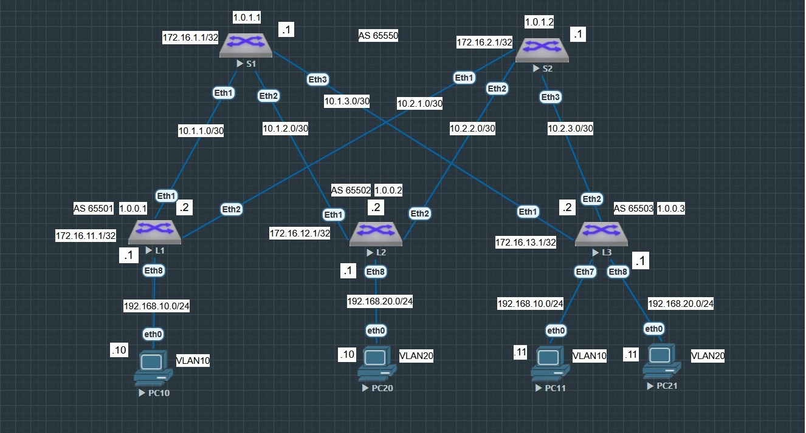
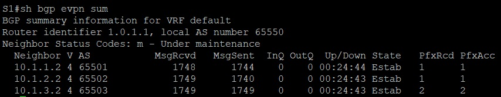
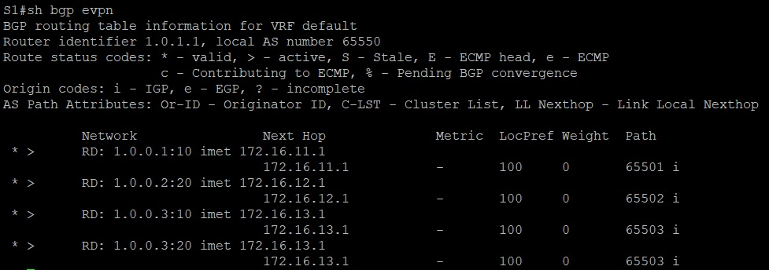
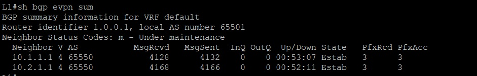
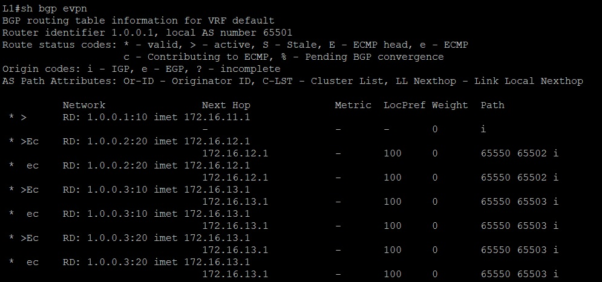
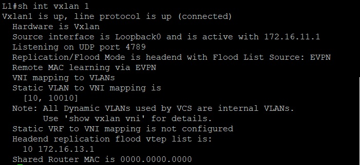
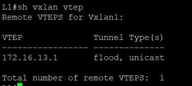

# Лабораторная работа №5. VxLAN. L2 VNI

## Цель

Настроить VxLAN EVPN поверх eBGP.

## Постановка задачи

Настроить Overlay на основе VxLAN EVPN для L2 связанности между клиентами.

## Описание задачи

Настроить BGP peering между Leaf и Spine в AF l2vpn evpn, настроить связанность между клиентами, зафиксировать в документации план работ, адресное пространство, схему сети,
конфигурацию устройств


В качестве исходной, взять сеть из лабораторной работы №4.

# Введение

## Термины

## Оборудование

1. Виртуальный коммутатор окружения Eve-NG на базе операционной системы vEOS версии EOS-4.29.2F
2. Виртуальный хост окружения Eve-NG

## Именование и термины

В качестве исходной сети была использована ранее спроектированная лабораторная сеть из Лаборатоной роботы №4. Все сетевые устройства имеют свои уникальные имена, отражающие их
функциональное назначение:

- S1 - Spine коммутатор №1
- S2 - Spine коммутатор №2

- L1 - Leaf коммутатор №1
- L2 - Leaf коммутатор №2
- L3 - Leaf коммутатор №3

- PC11 - Виртуальный хост №1, подкчобенный к Leaf коммутатору №1
- PC21 - Виртуальный хост №1, подкчобенный к Leaf коммутатору №2
- PC31 - Виртуальный хост №1, подкчобенный к Leaf коммутатору №3
- PC32 - Виртуальный хост №2, подкчобенный к Leaf коммутатору №3

### Таблица адресов сетевых устройств Spine

|N|Device|Port|IP Address|Prefix|
|:-:|:-:|:-:|:-:|:-:|
|1|S1|eth1|10.1.1.1|30|
|2|S1|eth2|10.1.2.1|30|
|3|S1|eth3|10.1.3.1|30|
|4|S2|eth1|10.2.1.1|30|
|5|S2|eth2|10.2.2.1|30|
|6|S2|eth3|10.2.3.1|30|

### Таблица адресов сетевых устройств Leaf

|N|Device|Port|IP Address|Prefix|
|:-:|:-:|:-:|:-:|:-:|
|1|L1|eth1|10.1.1.2|30|
|2|L1|eth2|10.2.1.2|30|
|3|L2|eth1|10.1.2.2|30|
|4|L2|eth2|10.2.2.2|30|
|5|L3|eth1|10.1.3.2|30|
|6|L3|eth2|10.2.3.2|30|

### Таблица Loopback адресов сетевых устройств

|N|Device|Port|IP Address|Prefix|
|:-:|:-:|:-:|:-:|:-:|
|1|S1|Lo0|172.16.1.1|32|
|2|S2|Lo0|172.16.2.1|32|
|3|L1|Lo0|172.16.11.1|32|
|4|L2|Lo0|172.16.12.1|32|
|5|L3|Lo0|172.16.13.1|32|

### Таблица адресов конечных устройств

|N|Device|Port|IP Address|Prefix|
|:-:|:-:|:-:|:-:|:-:|
|1|PC10|eth0|192.168.10.10|24|
|2|PC20|eth0|192.168.20.10|24|
|3|PC11|eth0|192.168.10.11|24|
|4|PC21|eth0|192.168.20.11|24|

## Описание стенда

В рамках лабораторной работы на предоставленном учебным центром лабораторном окружении было использовано пять коммутаторов. Данные коммутаторы были соеденины линиями связи по схеме CLOS,
два из которых (S1 и S2) выступают в качестве Spine устройств, и три (L1,L2 и L3) в качестве Leaf устройств. Схема сети в рамках лабораторного окружения представлена на рисунке ниже



## Настройка устройств

В рамках учебной лабораторной среды на всех сетевых устройствах был настроен протокол eBGP. В силу того, что в качестве UNDERLAY сети мы взяли протокол eBGP, поместим все Spine 
устройства в одну автономую систему (AS65550), у то время как каждое устройство Leaf будет находится в своей автономной системе (AS65501-AS65549). В силу того, что устройств Spine
как правило небольшое количество на стороне устройств Leaf мы можем их описать в ручном режиме. Однако Leaf устройств может быть достаточно много, для их описания на стороне Spine
применим pear фильтры.


Ниже приведены частичные настройки файлов конфигураций сетевых устройств:

#### Spine устройства

**S1**

```
service routing protocols model multi-agent
!
hostname S1
!
interface Ethernet1
   description <leaf L1>
   mtu 9214
   no switchport
   ip address 10.1.1.1/30
!
interface Ethernet2
   description <leaf L2>
   mtu 9214
   no switchport
   ip address 10.1.2.1/30
!
interface Ethernet3
   description <leaf L3>
   mtu 9214
   no switchport
   ip address 10.1.3.1/30
!
interface Loopback0
   ip address 172.16.1.1/32
!
ip routing
!
peer-filter LEAFS_ASN
   10 match as-range 65501-65503 result accept
!
router bgp 65550
   router-id 1.0.1.1
   no bgp default ipv4-unicast
   timers bgp 1 3
   distance bgp 20 200 200
   maximum-paths 2 ecmp 2
   bgp listen range 10.0.0.0/8 peer-group LEAF peer-filter LEAFS_ASN
   neighbor LEAF peer group
   neighbor LEAF out-delay 0
   neighbor LEAF bfd
   neighbor LEAF password 7 Wo42e/MSAGKzhGqxiFbmFQ==
   neighbor LEAF send-community extended
   !
   address-family evpn
      neighbor LEAF activate
      neighbor LEAF next-hop-unchanged
   !
   address-family ipv4
      neighbor LEAF activate
      network 172.16.1.1/32
!
end
```

**S2**

```
service routing protocols model multi-agent
!
hostname S2
!
interface Ethernet1
   description <leaf L1>
   mtu 9214
   no switchport
   ip address 10.2.1.1/30
!
interface Ethernet2
   description <leaf L2>
   mtu 9214
   no switchport
   ip address 10.2.2.1/30
!
interface Ethernet3
   description <leaf L3>
   mtu 9214
   no switchport
   ip address 10.2.3.1/30
!
interface Loopback0
   ip address 172.16.2.1/32
!
ip routing
!
peer-filter LEAFS_ASN
   10 match as-range 65501-65503 result accept
!
router bgp 65550
   router-id 1.0.1.2
   no bgp default ipv4-unicast
   timers bgp 1 3
   distance bgp 20 200 200
   maximum-paths 2 ecmp 2
   bgp listen range 10.0.0.0/8 peer-group LEAF peer-filter LEAFS_ASN
   neighbor LEAF peer group
   neighbor LEAF out-delay 0
   neighbor LEAF bfd
   neighbor LEAF password 7 Wo42e/MSAGKzhGqxiFbmFQ==
   neighbor LEAF send-community extended
   !
   address-family evpn
      neighbor LEAF activate
      neighbor LEAF next-hop-unchanged
   !
   address-family ipv4
      neighbor LEAF activate
      network 172.16.2.1/32
!
end
```

#### Leaf устройства

**L1**

```
service routing protocols model multi-agent
!
hostname L1
!
vlan 10
   name users1
!
interface Ethernet1
   description <spine S1>
   mtu 9214
   no switchport
   ip address 10.1.1.2/30
!
interface Ethernet2
   description <spine S2>
   mtu 9214
   no switchport
   ip address 10.2.1.2/30
!
interface Ethernet8
   description <PC10>
   mtu 9214
   switchport access vlan 10
!
interface Loopback0
   ip address 172.16.11.1/32
!
interface Vlan10
   description <User`s VLAN10>
!
interface Vxlan1
   vxlan source-interface Loopback0
   vxlan udp-port 4789
   vxlan vlan 10 vni 10010
!
ip routing
!
router bgp 65501
   router-id 1.0.0.1
   no bgp default ipv4-unicast
   timers bgp 1 3
   distance bgp 20 200 200
   maximum-paths 2 ecmp 2
   neighbor SPINE peer group
   neighbor SPINE remote-as 65550
   neighbor SPINE out-delay 0
   neighbor SPINE bfd
   neighbor SPINE password 7 bIFMJWqYLxH5gDSFoq95VA==
   neighbor SPINE send-community extended
   neighbor 10.1.1.1 peer group SPINE
   neighbor 10.2.1.1 peer group SPINE
   !
   vlan 10
      rd auto
      route-target both 10:10010
      redistribute learned
   !
   address-family evpn
      neighbor SPINE activate
   !
   address-family ipv4
      neighbor SPINE activate
      network 172.16.11.1/32
!
end
```

**L2**

```
service routing protocols model multi-agent
!
hostname L2
!
vlan 20
   name users2
!
interface Ethernet1
   description <spine S1>
   mtu 9214
   no switchport
   ip address 10.1.2.2/30
!
interface Ethernet2
   description <spine S2>
   mtu 9214
   no switchport
   ip address 10.2.2.2/30
!
interface Ethernet8
   description <PC20>
   mtu 9214
   switchport access vlan 20
!
interface Loopback0
   ip address 172.16.12.1/32
!
interface Vlan20
   description <User`s VLAN20>
!
interface Vxlan1
   vxlan source-interface Loopback0
   vxlan udp-port 4789
   vxlan vlan 20 vni 10020
!
ip routing
!
router bgp 65502
   router-id 1.0.0.2
   no bgp default ipv4-unicast
   timers bgp 1 3
   distance bgp 20 200 200
   maximum-paths 2 ecmp 2
   neighbor SPINE peer group
   neighbor SPINE remote-as 65550
   neighbor SPINE out-delay 0
   neighbor SPINE bfd
   neighbor SPINE password 7 bIFMJWqYLxH5gDSFoq95VA==
   neighbor SPINE send-community extended
   neighbor 10.1.2.1 peer group SPINE
   neighbor 10.2.2.1 peer group SPINE
   !
   vlan 20
      rd auto
      route-target both 20:10020
      redistribute learned
   !
   address-family evpn
      neighbor SPINE activate
   !
   address-family ipv4
      neighbor SPINE activate
      network 172.16.12.1/32
!
end
```

**L3**

```
service routing protocols model multi-agent
!
hostname L3
!
vlan 10
   name users1
!
vlan 20
   name users2
!
interface Ethernet1
   description <spine S1>
   mtu 9214
   no switchport
   ip address 10.1.3.2/30
!
interface Ethernet2
   description <spine S2>
   mtu 9214
   no switchport
   ip address 10.2.3.2/30
!
interface Ethernet7
   description <PC11>
   mtu 9214
   switchport access vlan 10
!
interface Ethernet8
   description <PC21>
   mtu 9214
   switchport access vlan 20
!
interface Loopback0
   ip address 172.16.13.1/32
!
interface Vlan3
   description <User`s VLAN>
   ip address 192.168.3.1/24
!
interface Vlan10
   description <User`s VLAN10>
!
interface Vlan20
   description <User`s VLAN20>
!
interface Vxlan1
   vxlan source-interface Loopback0
   vxlan udp-port 4789
   vxlan vlan 10 vni 10010
   vxlan vlan 20 vni 10020
!
ip routing
!
router bgp 65503
   router-id 1.0.0.3
   no bgp default ipv4-unicast
   timers bgp 1 3
   distance bgp 20 200 200
   maximum-paths 2 ecmp 2
   neighbor SPINE peer group
   neighbor SPINE remote-as 65550
   neighbor SPINE out-delay 0
   neighbor SPINE bfd
   neighbor SPINE password 7 bIFMJWqYLxH5gDSFoq95VA==
   neighbor SPINE send-community extended
   neighbor 10.1.3.1 peer group SPINE
   neighbor 10.2.3.1 peer group SPINE
   !
   vlan 10
      rd auto
      route-target both 10:10010
      redistribute learned
   !
   vlan 20
      rd auto
      route-target both 20:10020
      redistribute learned
   !
   address-family evpn
      neighbor SPINE activate
   !
   address-family ipv4
      neighbor SPINE activate
      network 172.16.13.1/32
!
end
```

## Описание типовых настроек

# Заключение

## Проверка работы сденда и результаты работы

Стенд может считаться рабочим в случае установления

**Суммарная информация по протоколу EVPN eBGP на коммутаторе S1 и S2**



**Таблица маршрутизации протокола EVPN eBGP на коммутаторе S1 и S2**



**Суммарная информация по протоколу EVPN eBGP на коммутаторе L1**



**Таблица маршрутизации протокола EVPN eBGP на коммутаторе L1**



**Информация по интерфейсу VXLAN на коммутаторе L1**



**Информация по устройствам терминации VTEP на коммутаторе L1**



**Суммарная информация по протоколу EVPN eBGP на коммутаторе L2**


**Таблица маршрутизации протокола EVPN eBGP на коммутаторе L2**


**Информация по интерфейсу VXLAN на коммутаторе L2**


**Информация по устройствам терминации VTEP на коммутаторе L2**


**Суммарная информация по протоколу EVPN eBGP на коммутаторе L3**


**Таблица маршрутизации протокола EVPN eBGP на коммутаторе L3**


**Информация по интерфейсу VXLAN на коммутаторе L3**


**Информация по устройствам терминации VTEP на коммутаторе L3**


Теперь проверим доступность конечных устройств PC11 и PC21 с тестовых конечных устройств PC10 и PC20:

**Получение ECHO ICMP ответа от устройств PC11 и PC21**


## Вывод

Был настроен протокол eBGP на рабочем стенде, собранного в соответствии с CLOS архитекрурой. Произведены испытания, показавшие наличие IP связности сетевых усторйств посредством
протокола eBGP между уровнями Spine и Leaf, а так же конечными устройствами.